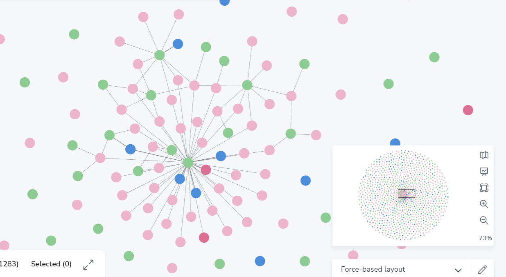

# 这是README

## 一些配置说明
### 目前的一些依赖，如果后面自己又加了一些什么的话，可以自行修改此README

代码编辑器： VS Code
使用了python自带的虚拟环境功能venv，出了什么问题删环境重做~~跑路~~无压力。**前提是保留好自己写的东西。**
venv教程：https://zhuanlan.zhihu.com/p/341481537

### 可能列出来的依赖并未完全包含，有问题敲我

| 软件 | 版本 |
|---|---|
| Python | 3.10.9 |
| torch | 1.13.1 |
| jupyter | lastest |
| transformers | 4.26.1 |
| huggingface-hub | 0.12.1 |
| PyMuPDF | 1.21.1 |
| beautifulsoup4 | 4.11.2 |
| soupsieve | 2.4 |
| neo4j | lastest |

## 在编写代码的时候请加好注释，同时建议模块化，方便理解

## 2023.3.14更新
目前知识图谱含有节点1183个，722个关系
五个节点种类：Disease, Chemical, Genetic, Treatment(少量，人工标注),Variant

